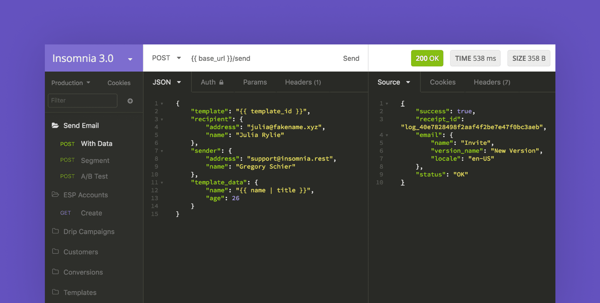
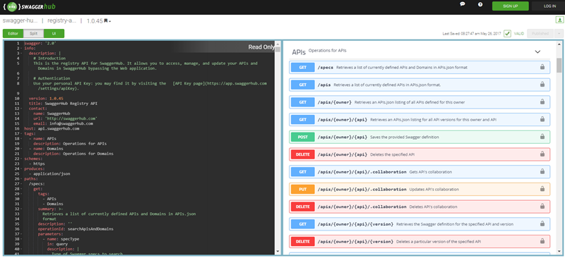
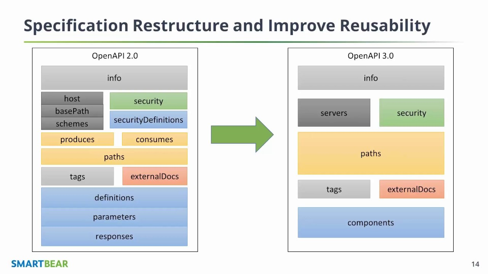

# Documentação de API no NestJS

Ao iniciarmos um projeto de backend com o design de uma API em mente, normalmente no nosso fluxo de desenvolvimento a primeira coisa que fazemos é utilizar um simulador de requisições como o [Insomnia](https://insomnia.rest/) ou o [Postman](https://www.postman.com/) para que possamos fazer as chamadas REST sem ter a necessidade de um cliente web, que pode ser implementado pela equipe do frontend, podendo assim desenvolver a API sem travas e dependências de outras equipes.

E com a possibilidade de automatizar o fluxo de requests, pegando a resposta de um request e inserindo em outro automaticamente facilita demais os testes de fluxo para os desenvolvedores. No entanto em outras situações em que é necessário uma documentação de uma qualidade melhor essas ferramnetas já não são ideais, e é aí que entram o Swagger e o OpenAPI.
<br>



<br>

## Porque então usar o [Swagger](https://swagger.io/)/[OpenAPI](https://github.com/OAI/OpenAPI-Specification/blob/main/versions/3.1.0.md) quando você pode utilizar sua API REST definida no Insomnia/Postman?

<br>



<br>
A necessidade para uma documentação mais clara começa a ficar aparente quando o projeto tem novos membros entrando ou o cliente quer explicações detalhadas do que está acontecendo na API ou como um novo request será aplicado e os seus exemplos que mostrem os impactos na aplicação.
<br><br>
Se tudo o que o projeto tem está definido no Insomnia, por exemplo, é difícil de mostrar para o cliente o que está acontecendo a cada request, já que muitas vezes o requests podem estar atrelados a outros, com respostas de alguns requests que são usados em outros já automatizados. Enquanto isso deixa tudo muito fácil para o time do desenvolvimento, quem não está atrelado pode acabar ficando confuso com o fluxo dos dados.
<br><br>
O OpenAPI abre a possibilidade de se ter uma documentação clara e concisa bem como uma página na web através do Swagger UI que detalha a documentação o que deixa ela muito fácil de usar, com cada request tendo sua descrição, sumário, exemplos de input e output, bem como campos requiridos e uma lista de Schemas/Dtos no fim da página que lista objetos que são utilizados nos requests.
<br><br>


<br>

## O que são as especificações de documentação Swagger, OpenAPI 2.0 e OpenAPI 3.0?

<br>
Apesar de seus nomes serem diferentes, Swagger e OpenAPI são na verdade o mesmo padrão, quando a companhia por trás do Swagger foi comprada, seus novos donos a Smart Bears renomeou a especificação para OpenAPI. O que faz com que o Swagger original seja na verdade um OpenAPI 1.0, o primeiro grande lançamento.
<br><br>
Quando a segunda versão foi lançada, ela foi entitulada OpenAPI 2.0 e mais recentemente nós temos também a nova grande versão de lançamento que está sendo amplamente adotada, chamada de OpenAPI 3.0, abaixo podemos ver que a OpenAPI 3.0 trás muitas abstrações genéricas para a especificação, com uma melhor reusabilidade e simplificação de objetos. OpenAPI 3.0 é o que vamos utilizar no NestJS.
<br><br>


<br><br>

## OpenAPI no NestJS

<br>
NestJS na verdade possui um módulo dedicado para gerar documentação da OpenAPI que facilita e muito na hora de implementar a especificação, com decoradores dedicados para cada necessidade do schema da OpenAPI. Aqui irei citar alguns dos decoradores e as principais vantagens de utilizar o módulo do NestJS:
<br><br>

<b>@ApiTags</b> - pode ser utilizado no controller para definir uma tag para todos os métodos de uma vez só, muito útil já que no schema do OpenAPI ele deve definir tags para cada request.

```typescript
@ApiTags("user")
@Controller("user")
export class UserController {}
```

<b>@ApiProperty</b> - pode ser utilizado nos Dtos para definir atributos da API.

```typescript
@ApiProperty({
  description: 'The age of the user',
  minimum: 1,
  default: 1,
})
age: number;
```

<b>@ApiHeaders</b> - pode ser utilizado nos controllers para definir headers da requisição da API.

```typescript
@ApiHeader({
  name: "X-Authorization-AWS",
  description: "AWS authorization header",
})
@Controller("user")
export class UserController {}
```

<b>@ApiResponse</b> - pode ser utilizado nas requisições REST para definir respostas da API.

```typescript
@Post()
@ApiResponse({ status: 201, description: 'The record has been successfully created.'})
@ApiResponse({ status: 403, description: 'Forbidden.'})
async create(@Body() createUserDto: CreateUserDto) {
  this.userService.create(createUserDto);
```

<b>@ApiBearerAuth</b> - indica a necessidade de autenticação para chamar uma requisição, pode ser usado tanto no controller quanto em métodos específicos.

```typescript
@ApiBasicAuth()
@Controller("user")
export class UserController {}
```

<b>Dtos em Schema</b> - As ApiProperties nos Dtos definem os Schemas que são utilizados pelo OpenAPI.

```typescript
import { ApiProperty } from "@nestjs/swagger";

export class CreateUserDto {
  // note here that ApiProperty can be called without any properties
  @ApiProperty()
  name: string;
  // or with more properties with a better definition
  @ApiProperty({
    description: "The age of the user",
    minimum: 1,
    default: 1,
  })
  age: number;

  @ApiProperty()
  address: string;
}
```

<br>
Para ir além dessa introdução aqui estão os links para documentação oficial do NestJS em OpenAPI e também um vídeo tutorial que mostra como aplicar o Swagger no NestJS por Paulo Salvatore:

<b>Documentação:</b> [Documentação OpenAPI NestJS](https://docs.nestjs.com/openapi/introduction)

<b>Tutorial:</b> [Como aplicar Swagger em NestJS](https://www.youtube.com/watch?v=fshX_252HbU)
